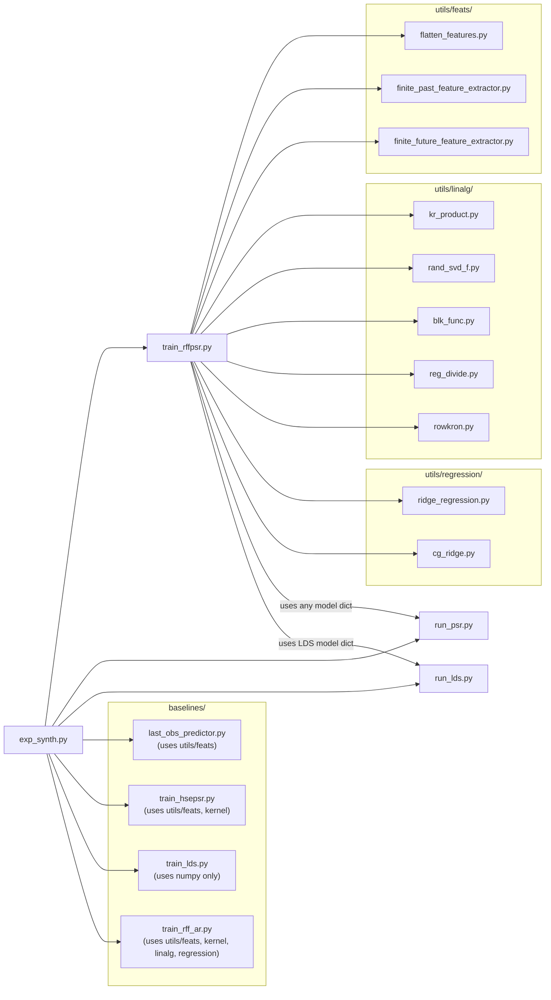

# DESIGN.md - RFF-PSR Python Implementation

> **Paper:** Hefny, A., Downey, C., & Gordon, G. (2017).
> *"Supervised Learning for Dynamical System Learning."*
> NIPS 2015 workshop version; extended preprint at
> **arXiv:1702.03537** (also published at AAAI 2018 as
> *"An Efficient, Expressive and Local Minima-free Method for Learning
> controlled Dynamical Systems"*).

---

1. [Overview](#1-overview)
2. [Repository Layout](#2-repository-layout)
3. [Theoretical Background](#3-theoretical-background)
4. [Utility Layer](#4-utility-layer)
5. [Core Algorithm - `train_rffpsr.py`](#5-core-algorithm--train_rffpsrpy)
6. [Baseline Models](#6-baseline-models)
7. [Inference Loop](#7-inference-loop--run_psrpy-and-run_ldspy)
8. [Experiment Scripts](#8-experiment-scripts--exp_synthpy)
9. [Test Suite](#9-test-suite)
10. [Configuration References](#10-configuration-references)

---

## 1. Overview

### Purpose

This codebase is a complete **Python translation** of the original MATLAB implementation of **RFF-PSR** (Random Fourier Features Predictive State Representation), a method for learning models of controlled dynamical systems directly from input/output trajectories.

A **Predictive State Representation** encodes the belief state of a dynamical system as a vector that predicts the distribution of *future* observations given the *past* history. Unlike latent-variable models (HMMs, Kalma filters), PSRs are identifiable, have no local minima in the population limit, and can be trained entirely by refression on observed data.

**RFF-PSR** scales the original kernel-based HSE-PSR (Boots et al., 2013; Song et al., 2010) to large datasets by replacing exact Gram matrices with **Random Fourier Feature** (RFF) approximations (Rhimi & Recht, 2007), reducing both time and memory from $O(N^2)/O(N^3)$, to $O(N D)$ where $D << N$. An optional **BPTT refinement** stage (back-propagation through time) further reduces multi-step prediction error.

| Aspect                   | MATLAB original        | Python translation                                   |
|--------------------------|------------------------|------------------------------------------------------|
| Entry point              | `code/exp_synth.m`       | `python/exp_synth.py`                                  |
| Core training            | `code/train_effpsr.m`    | `python/train_rffpsr.py`                               |
| Data format              | `.mat` cell arrays       | `list[np.ndarray]`                                     |
| Structs/function handles | MATLAB `struct`, `@(x)...` | Python `dict`, `lambda` / nested functions               |
| Indexing                 | 1-based                | 0-based (all index translations are commented inline) |
| Linear algebra           | MATLAB builtins        | Numpy / SciPy                                        |

All equation and page references in the source code refer to **arXiv:1702.03537**. Section numbers follow the arXis preprint (not the AAAI proceedings).

### Quick Start

```bash
# From the repository root
cd python

# Install dependencies (requires internet access; see note below for air-gapped envs)
pip install numpy scipy matplotlib

# Run the synthetic experiment (trains all models, saves results_synth.png)
python exp_synth.py

# Skip the slow $O(N^3)$ HSE-PSR baseline
python exp_synth.py --skip-hsepsr

# Run the test suite (requires pytest)
pip install pytest
python -m pytest tests/ -v
```

> **Air-gapped / corporate environments:** If corporate Artifactory
> mirrow does not carry `pytest`.  Install packages from an external machine,
> bundle as a wheelhouse, and install with `pip install --no-index --find-links`
> `/path/to/wheelhouse pytest scipy matplotlib`.
---

## 2. Repository Layout

```text
rff-psr-py/                                            # 
├── DESIGN.md                                          # This document
├── LICENSE                                            # 
├── TESTING.md                                         # 
├── data/                                              # 
│   └── synth.mat                                      # Synthetic benchmark dataset
└── python/                                            # All Python source lives here
    ├── baselines/                                     # Comparison models
    │   ├── last_obs_predictor.py                      # Trivial "repeat last observation" baseline
    │   ├── train_hsepsr.py                            # Exact HSE-PSR using Gram matrices ($O(N^3)$)
    │   ├── train_lds.py                               # Linear Dynamical System via N4SID subspace ID
    │   └── train_rff_ar.py                            # RFF-based auto-regressive (ARX) model
    ├── conftest.py                                    # pytest sys.path bootstrap (python/ -> sys.path)
    ├── exp_synth.py                                   # Experiment: trains all models, evaluates MSE, plots
    ├── run_lds.py                                     # Multi-step prediction loop for LDS models
    ├── run_psr.py                                     # Filter/predict loop for any PSR model
    ├── train_rffpsr.py                                # Core: RFF-PSR training (Algorithm 1 + 2)
    └── utils/                                         # 
        ├── feats/                                     # Feature extraction from time-series windows
        │   ├── __init__.py                            # 
        │   ├── finite_future_feature_extractor.py     # Factory: future window q_t = [o_{t:t+k-1}] 
        │   ├── finite_past_feature_extractor.py       # Factory: history window h_t = [o_{t-L:t-1}]
        │   ├── flatten_features.py                    # Applies extractor to all (seq, t) pairs -> matrix
        │   ├── timewin_feature_extractor.py           # Factory: wraps timewin_features as callable
        │   └── timewin_features.py                    # Core sliding-window extractor (zero-pads OOB)
        ├── kernel/                                    # Kernel function utilities
        │   ├── func_rff.py                            # Random Fourier Features: $z(x)=(1/\sqrt{D})[cos(Wx); sin(Wx)]$
        │   └── median_bandwidth.py                    # Median-heuristic RBF bandwidth estimation
        ├── linalg/                                    # 
        │   ├── blk_func.py                            # Block-wise column evaluation to avoid memory overflow
        │   ├── kr_product.py                          # Khatri-Rao (column-wise Kronecker) product
        │   ├── rand_svd_f.py                          # Randomised SVD for implicitly-defined matrices
        │   ├── reg_divide.py                          # Regularised division: $X (Y + \lambda I)^{-1}$
        │   └── rowkron.py                             # Kronecker product of two row vectors (BPTT gradient helper)
        ├── normalize_sequences.py                     # Global mean/std normalization of trajectory lists
        ├── numerical_jacobian.py                      # Central finite-difference Jacobian (for grad-check)
        ├── regression/                                # Regression solvers
        │   ├── cg_ridge.py                            # CG-based ridge regression (memory-efficient for large D)
        │   └── ridge_regression.py                    # Direct ridge regression: $W = Y X^T (X X^T + \lambda I)^{-1}$
        └── validate_jacobian.py                       # compares analytical vs numerical Jacobian 
```

### Dependency graph (high level)



### Model dictionary contract

Every trained model - RFF-PSR, ARX, Last-Obs, HSE-PSR, and LDS - is
represented as a plain Python `dict` with the following **mandatory keys**

| Key        | Type                                      | Description               |
|------------|-------------------------------------------|---------------------------|
| `'f0'`         | `ndarray(p,1)`                              | Initial belief state      |
| `'future_win'` | `int`                                       | prediction horizon *k*    |
| `'filter'`     | `callable(model, f, o, a) -> f_new`         | State update function     |
| `'predict'`    | `callable(model, f, a) -> o_hat`            | 1-step prediction         |
| `'test'`       | `callable(model, f, a_win) -> O_hat (d, k)` | k-step horizon prediction |

`run_psr.py` calls only these five keys, making every model a drop-in replacement for any other without changing the evaluation code.

---

## 3. Theoretical Background

### 3.1 predictive State Representations

A **Predictive State Representation (PSR)** is a model of a *controlled
dynamical system* - a system driven by external actions $a_t \in \mathbb{R}^{d_a}$
that emits observations $o_t \in \mathbb{R}^{d_o}$ at each time step $t$.
Unlike Hidden Markov Models or Kalman filters, a PSR does not posit a latent
variable: the belief state $f_t$ is defined entirely in terms of **predictions
about future observations**.

Formally, let

$$h_t = [o_{t-L}, \ldots, o_{t-1},\; a_{t-L}, \ldots, a_{t-1}] \in \mathbb{R}^{(d_o + d_a) L}$$

be the **history window** of length $L$ (the last $L$ observation-action pairs). and let

$$q_t = [o_{t}, \ldots, o_{t+k-1},\; a_{t}, \ldots, a_{t+k-1}] \in \mathbb{R}^{(d_o + d_a) k} $$

be the **test window** (future window) of length $k$.  The PSR state $f_t$
is chosen so that it is a *sufficient statistic* for predicting any function
of the future $q_t$ conditioned on the history $h_t$:

$$f_t \text{ captures } P(q_t \mid h_t).$$

At each time step the system provides three primitives:

| Primitive   | Signature                              | Description                                          |
|-------------|----------------------------------------|------------------------------------------------------|
| **filter**  | $(f_t, o_t, a_t) \to f_{t+1}$          | Incorporate new evidence; shift belief state forward |
| **predict** | $(f_t, a_t) \to \hat{o}_t$             | One-step observation prediction                      |
| **test**    | $(f_t, a_{t:t+k}) \to \hat{o}_{t:t+k}$ | $k$-step horizon prediction                          |

---

### 3.2 Kernel Embedding and HSE-PSR

The key statistical quantities needed for filtering and prediction are
**cross-covariance operators** between the kernel embeddings of $h_t$ and
$q_t$.  For an RBF kernel $\kappa(x, y) = \exp(-\|x-y\|^2 / (2s^2))$, the
embedding is the feature map $\varphi(x)$ into the reproducing kernel
Hilbert space (RKHS).  The operator

$$
\mathcal{C}_{q \mid h} = \mathcal{C}_{qh}\,\mathcal{C}_{hh}^{-1}
$$

is the conditional mean embedding of $P(q_t \mid h_t)$ (Song et al., 2009;
Boots et al., 2013).

**HSE-PSR** (Hilbert Space Embedding PSR) represents $f_t$ as this conditional
mean embedding, estimated from data via kernel ridge regression over the
training sample:

$$
\hat{\mathcal{C}}_{q \mid h} = K_{hq}\,(K_{hh} + \lambda N I)^{-1}
$$

where $K_{hh} \in \mathbb{R}^{N \times N}$ is the Gram matrix. This has two
critical drawbacks:

- **Memory:** $O(N^2)$ to store $K_{hh}$
- **Time:** $O(N^3)$ to solve the linear system.

For the synthetic benchmark (N = a few thousands) HSR-PSR is feasible, but
disabled by default (`--no-hsepsr`) because of these costs.

---

### 3.3 Random Fourier Feature Approximation

**RFF-PSR** replaces the exact kernel with Bochner's theorem (Rahimi & Recht,
2007): a shift-invariant kernel $\kappa(x, y) = \kappa(x-y)$ can be written as

$$
\kappa(x,y) = \mathbb{E}_{w \sim p(w)} \left[ e^{i w^\top (x - y)}\right] 
$$

where $p(w) = \mathcal{F} \{\kappa\}$ is the Fourier transform of the kernel.
For the Gaussian (RBF) kernel with bandwidth $s$:

$$
p(w) = \mathcal{N}(0,\, s^{-2} I).
$$

Drawing $D$ i.i.d. frequency vectors $w_j \sim p(w)$, the approximation

$$
\varphi(x) = \frac{1}{\sqrt{D}} \begin{bmatrix} \cos(W x)\\\sin(W x) \end{bmatrix}
\in \mathbb{R}^{2D}, \qquad
W \in \mathbb{R}^{D \times d}, \quad W_{j\cdot} = w_j^\top
\tag{1}$$

satisfies $\varphi(x)^\top \varphi(y) \approx \kappa(x, y)$. The implementation
is in [python/utils/kernel/func_rff.py](python/utils/kernel/func_rff.py).

With RFF, the $N \times N$ Gram matrices become products of $N \times 2D$
feature matrices. Memory drops from $O(N^2)$ to $O(N D)$, and the dominant
cost becomes $O(N D p)$ with a subsequent SVD-based projection to $p \ll D$
dimensions.

**Bandwidth selection** uses the *median heuristic* (Gretton et al., 2012):

$s = \sqrt{\text{median}_i(\|x_i - x_j\|^2)}$ over a random subsample of up
to 5 000 points. Implemented in
[python/utils/kernel/median_bandwidth.py](python/utils/kernel/median_bandwidth.py).

---

### 3.4 Dimensionality Reduction

Even with RFF, a $2D$-dimensional feature vector can be large.  The paper
reduces each feature type to $p$ dimensions via a **randomised SVD**
(Halko, Martinsoson & Tropp, 2011):

$$
U = \text{rand\_svd}(\Phi), \qquad
\psi(x) = U^\top \varphi(x) \in \mathbb{R}^p.
$$

The randomised SVD is applied to the empirical feature matrix
$\Phi \in \mathbb{R}^{2D \times N}$ for each feature type ($h$, $o$, $a$,
$q^o$, $q^a$, and derived products).  An optional **bias augmentation**
appends a constant 1 to the projected feature, controlled by the `const`
option bitmask:

$$
\psi_\text{aug}(x) = \begin{bmatrix} U^\top \varphi(x) \\ 1 \end{bmatrix} \in \mathbb{R}^{p+1}.
$$

Implemented in [python/utils/linalg/rand_svd_f.py](python/utils/linalg/rand_svd_f.py).

---

### 3.5 Two-Stage Regression (Algorithm 1)

This is the core of the *supervised learning* approach: all parameters are
estimated by ordinary ridge regression on the training data.

**Notation used throughout:**