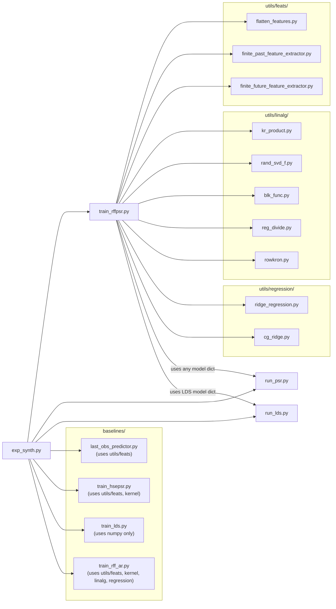

# DESIGN.md - RFF-PSR Python Implementation

> **Paper:** Hefny, A., Downey, C., & Gordon, G. (2017).
> *"Supervised Learning for Dynamical System Learning."*
> NIPS 2015 workshop version; extended preprint at
> **arXiv:1702.03537** (also published at AAAI 2018 as
> *"An Efficient, Expressive and Local Minima-free Method for Learning
> controlled Dynamical Systems"*).

---

1. [Overview](#1-overview)
2. [Repository Layout](#2-repository-layout)
3. [Theoretical Background](#3-theoretical-background)
4. [Utility Layer](#4-utility-layer)
5. [Core Algorithm - `train_rffpsr.py`](#5-core-algorithm--train_rffpsrpy)
6. [Baseline Models](#6-baseline-models)
7. [Inference Loop](#7-inference-loop--run_psrpy-and-run_ldspy)
8. [Experiment Scripts](#8-experiment-scripts--exp_synthpy)
9. [Test Suite](#9-test-suite)
10. [Configuration References](#10-configuration-references)

---

## 1. Overview

### Purpose

This codebase is a complete **Python translation** of the original MATLAB implementation of **RFF-PSR** (Random Fourier Features Predictive State Representation), a method for learning models of controlled dynamical systems directly from input/output trajectories.

A **Predictive State Representation** encodes the belief state of a dynamical system as a vector that predicts the distribution of *future* observations given the *past* history. Unlike latent-variable models (HMMs, Kalma filters), PSRs are identifiable, have no local minima in the population limit, and can be trained entirely by refression on observed data.

**RFF-PSR** scales the original kernel-based HSE-PSR (Boots et al., 2013; Song et al., 2010) to large datasets by replacing exact Gram matrices with **Random Fourier Feature** (RFF) approximations (Rhimi & Recht, 2007), reducing both time and memory from $O(N^2)/O(N^3)$, to $O(N D)$ where $D << N$. An optional **BPTT refinement** stage (back-propagation through time) further reduces multi-step prediction error.

| Aspect                   | MATLAB original        | Python translation                                   |
|--------------------------|------------------------|------------------------------------------------------|
| Entry point              | `code/exp_synth.m`       | `python/exp_synth.py`                                  |
| Core training            | `code/train_effpsr.m`    | `python/train_rffpsr.py`                               |
| Data format              | `.mat` cell arrays       | `list[np.ndarray]`                                     |
| Structs/function handles | MATLAB `struct`, `@(x)...` | Python `dict`, `lambda` / nested functions               |
| Indexing                 | 1-based                | 0-based (all index translations are commented inline) |
| Linear algebra           | MATLAB builtins        | Numpy / SciPy                                        |

All equation and page references in the source code refer to **arXiv:1702.03537**. Section numbers follow the arXis preprint (not the AAAI proceedings).

### Quick Start

```bash
# From the repository root
cd python

# Install dependencies (requires internet access; see note below for air-gapped envs)
pip install numpy scipy matplotlib

# Run the synthetic experiment (trains all models, saves results_synth.png)
python exp_synth.py

# Skip the slow $O(N^3)$ HSE-PSR baseline
python exp_synth.py --skip-hsepsr

# Run the test suite (requires pytest)
pip install pytest
python -m pytest tests/ -v
```

> **Air-gapped / corporate environments:** If corporate Artifactory
> mirrow does not carry `pytest`.  Install packages from an external machine,
> bundle as a wheelhouse, and install with `pip install --no-index --find-links`
> `/path/to/wheelhouse pytest scipy matplotlib`.
---

## 2. Repository Layout

```text
rff-psr-py/                                            # 
├── DESIGN.md                                          # This document
├── LICENSE                                            # 
├── TESTING.md                                         # 
├── data/                                              # 
│   └── synth.mat                                      # Synthetic benchmark dataset
└── python/                                            # All Python source lives here
    ├── baselines/                                     # Comparison models
    │   ├── last_obs_predictor.py                      # Trivial "repeat last observation" baseline
    │   ├── train_hsepsr.py                            # Exact HSE-PSR using Gram matrices ($O(N^3)$)
    │   ├── train_lds.py                               # Linear Dynamical System via N4SID subspace ID
    │   └── train_rff_ar.py                            # RFF-based auto-regressive (ARX) model
    ├── conftest.py                                    # pytest sys.path bootstrap (python/ -> sys.path)
    ├── exp_synth.py                                   # Experiment: trains all models, evaluates MSE, plots
    ├── run_lds.py                                     # Multi-step prediction loop for LDS models
    ├── run_psr.py                                     # Filter/predict loop for any PSR model
    ├── train_rffpsr.py                                # Core: RFF-PSR training (Algorithm 1 + 2)
    └── utils/                                         # 
        ├── feats/                                     # Feature extraction from time-series windows
        │   ├── __init__.py                            # 
        │   ├── finite_future_feature_extractor.py     # Factory: future window q_t = [o_{t:t+k-1}] 
        │   ├── finite_past_feature_extractor.py       # Factory: history window h_t = [o_{t-L:t-1}]
        │   ├── flatten_features.py                    # Applies extractor to all (seq, t) pairs -> matrix
        │   ├── timewin_feature_extractor.py           # Factory: wraps timewin_features as callable
        │   └── timewin_features.py                    # Core sliding-window extractor (zero-pads OOB)
        ├── kernel/                                    # Kernel function utilities
        │   ├── func_rff.py                            # Random Fourier Features: $z(x)=(1/\sqrt{D})[cos(Wx); sin(Wx)]$
        │   └── median_bandwidth.py                    # Median-heuristic RBF bandwidth estimation
        ├── linalg/                                    # 
        │   ├── blk_func.py                            # Block-wise column evaluation to avoid memory overflow
        │   ├── kr_product.py                          # Khatri-Rao (column-wise Kronecker) product
        │   ├── rand_svd_f.py                          # Randomised SVD for implicitly-defined matrices
        │   ├── reg_divide.py                          # Regularised division: $X (Y + \lambda I)^{-1}$
        │   └── rowkron.py                             # Kronecker product of two row vectors (BPTT gradient helper)
        ├── normalize_sequences.py                     # Global mean/std normalization of trajectory lists
        ├── numerical_jacobian.py                      # Central finite-difference Jacobian (for grad-check)
        ├── regression/                                # Regression solvers
        │   ├── cg_ridge.py                            # CG-based ridge regression (memory-efficient for large D)
        │   └── ridge_regression.py                    # Direct ridge regression: $W = Y X^T (X X^T + \lambda I)^{-1}$
        └── validate_jacobian.py                       # compares analytical vs numerical Jacobian 
```

### Dependency graph (high level)



### Model dictionary contract

Every trained model - RFF-PSR, ARX, Last-Obs, HSE-PSR, and LDS - is
represented as a plain Python `dict` with the following **mandatory keys**

| Key        | Type                                      | Description               |
|------------|-------------------------------------------|---------------------------|
| `'f0'`         | `ndarray(p,1)`                              | Initial belief state      |
| `'future_win'` | `int`                                       | prediction horizon *k*    |
| `'filter'`     | `callable(model, f, o, a) -> f_new`         | State update function     |
| `'predict'`    | `callable(model, f, a) -> o_hat`            | 1-step prediction         |
| `'test'`       | `callable(model, f, a_win) -> O_hat (d, k)` | k-step horizon prediction |

`run_psr.py` calls only these five keys, making every model a drop-in replacement for any other without changing the evaluation code.

---

## 3. Theoretical Background

### 3.1 predictive State Representations

A **Predictive State Representation (PSR)** is a model of a *controlled
dynamical system* - a system driven by external actions $a_t \in \mathbb{R}^{d_a}$
that emits observations $o_t \in \mathbb{R}^{d_o}$ at each time step $t$.
Unlike Hidden Markov Models or Kalman filters, a PSR does not posit a latent
variable: the belief state $f_t$ is defined entirely in terms of **predictions
about future observations**.

Formally, let

$$h_t = [o_{t-L}, \ldots, o_{t-1},\; a_{t-L}, \ldots, a_{t-1}] \in \mathbb{R}^{(d_o + d_a) L}$$

be the **history window** of length $L$ (the last $L$ observation-action pairs). and let

$$q_t = [o_{t}, \ldots, o_{t+k-1},\; a_{t}, \ldots, a_{t+k-1}] \in \mathbb{R}^{(d_o + d_a) k} $$

be the **test window** (future window) of length $k$.  The PSR state $f_t$
is chosen so that it is a *sufficient statistic* for predicting any function
of the future $q_t$ conditioned on the history $h_t$:

$$f_t \text{ captures } P(q_t \mid h_t).$$

At each time step the system provides three primitives:

| Primitive   | Signature                              | Description                                          |
|-------------|----------------------------------------|------------------------------------------------------|
| **filter**  | $(f_t, o_t, a_t) \to f_{t+1}$          | Incorporate new evidence; shift belief state forward |
| **predict** | $(f_t, a_t) \to \hat{o}_t$             | One-step observation prediction                      |
| **test**    | $(f_t, a_{t:t+k}) \to \hat{o}_{t:t+k}$ | $k$-step horizon prediction                          |

---

### 3.2 Kernel Embedding and HSE-PSR

The key statistical quantities needed for filtering and prediction are
**cross-covariance operators** between the kernel embeddings of $h_t$ and
$q_t$.  For an RBF kernel $\kappa(x, y) = \exp(-\|x-y\|^2 / (2s^2))$, the
embedding is the feature map $\varphi(x)$ into the reproducing kernel
Hilbert space (RKHS).  The operator

$$
\mathcal{C}_{q \mid h} = \mathcal{C}_{qh}\,\mathcal{C}_{hh}^{-1}
$$

is the conditional mean embedding of $P(q_t \mid h_t)$ (Song et al., 2009;
Boots et al., 2013).

**HSE-PSR** (Hilbert Space Embedding PSR) represents $f_t$ as this conditional
mean embedding, estimated from data via kernel ridge regression over the
training sample:

$$
\hat{\mathcal{C}}_{q \mid h} = K_{hq}\,(K_{hh} + \lambda N I)^{-1}
$$

where $K_{hh} \in \mathbb{R}^{N \times N}$ is the Gram matrix. This has two
critical drawbacks:

- **Memory:** $O(N^2)$ to store $K_{hh}$
- **Time:** $O(N^3)$ to solve the linear system.

For the synthetic benchmark (N = a few thousands) HSR-PSR is feasible, but
disabled by default (`--no-hsepsr`) because of these costs.

---

### 3.3 Random Fourier Feature Approximation

**RFF-PSR** replaces the exact kernel with Bochner's theorem (Rahimi & Recht,
2007): a shift-invariant kernel $\kappa(x, y) = \kappa(x-y)$ can be written as

$$
\kappa(x,y) = \mathbb{E}_{w \sim p(w)} \left[ e^{i w^\top (x - y)}\right] 
$$

where $p(w) = \mathcal{F} \{\kappa\}$ is the Fourier transform of the kernel.
For the Gaussian (RBF) kernel with bandwidth $s$:

$$
p(w) = \mathcal{N}(0,\, s^{-2} I).
$$

Drawing $D$ i.i.d. frequency vectors $w_j \sim p(w)$, the approximation

$$
\varphi(x) = \frac{1}{\sqrt{D}} \begin{bmatrix} \cos(W x)\\\sin(W x) \end{bmatrix}
\in \mathbb{R}^{2D}, \qquad
W \in \mathbb{R}^{D \times d}, \quad W_{j\cdot} = w_j^\top
\tag{1}$$

satisfies $\varphi(x)^\top \varphi(y) \approx \kappa(x, y)$. The implementation
is in [python/utils/kernel/func_rff.py](python/utils/kernel/func_rff.py).

With RFF, the $N \times N$ Gram matrices become products of $N \times 2D$
feature matrices. Memory drops from $O(N^2)$ to $O(N D)$, and the dominant
cost becomes $O(N D p)$ with a subsequent SVD-based projection to $p \ll D$
dimensions.

**Bandwidth selection** uses the *median heuristic* (Gretton et al., 2012):

$s = \sqrt{\text{median}_i(\|x_i - x_j\|^2)}$ over a random subsample of up
to 5 000 points. Implemented in
[python/utils/kernel/median_bandwidth.py](python/utils/kernel/median_bandwidth.py).

---

### 3.4 Dimensionality Reduction

Even with RFF, a $2D$-dimensional feature vector can be large.  The paper
reduces each feature type to $p$ dimensions via a **randomised SVD**
(Halko, Martinsoson & Tropp, 2011):

$$
U = \text{rand\_svd}(\Phi), \qquad
\psi(x) = U^\top \varphi(x) \in \mathbb{R}^p.
$$

The randomised SVD is applied to the empirical feature matrix
$\Phi \in \mathbb{R}^{2D \times N}$ for each feature type ($h$, $o$, $a$,
$q^o$, $q^a$, and derived products).  An optional **bias augmentation**
appends a constant 1 to the projected feature, controlled by the `const`
option bitmask:

$$
\psi_\text{aug}(x) = \begin{bmatrix} U^\top \varphi(x) \\ 1 \end{bmatrix} \in \mathbb{R}^{p+1}.
$$

Implemented in [python/utils/linalg/rand_svd_f.py](python/utils/linalg/rand_svd_f.py).

---

### 3.5 Two-Stage Regression (Algorithm 1)

This is the core of the *supervised learning* approach: all parameters are
estimated by ordinary ridge regression on the training data.

**Notation used throughout:**

| Symbol                                                        | Dimension                              | Meaning                                                                |
|---------------------------------------------------------------|----------------------------------------|------------------------------------------------------------------------|
| $N$                                                           | scalar                                 | number of training (time-step) samples                                 |
| $L$                                                           | scalar                                 | history window length (`past_win`)                                     |
| $k$                                                           | scalar                                 | future window length (`future_win`)                                    |
| $D$                                                           | scalar                                 | number of RFF frequencies                                              |
| $p$                                                           | scalar                                 | projected (state) dimension                                            |
| $\lambda$                                                     | scalar                                 | ridge regularisation parameter                                         |
| $d_o, d_a$                                                    | scalar                                 | observation / action dimension                                         |
| $\varphi_h, \varphi_o, \varphi_a, \varphi_{to}, \varphi_{ta}$ | $\mathbb{R}^{2D}$                      | raw RFF maps for $h, o, a, q^o, q^a$                                   |
| $\psi_h, \psi_o, \psi_a, \psi_{to}, \psi_{ta}$                | $\mathbb{R}^{p}$ or $\mathbb{R}^{p+1}$ | projected features                                                     |
| $\psi_{oo}$                                                   | $\mathbb{R}^{K_{oo}}$                  | projected Khatri-Rao self-product $\psi_o \otimes \psi_o$              |
| $\psi_{\eta}$                                                 | $\mathbb{R}^{K_\eta}$                  | projected extended test-action: $\psi_a \otimes \psi_{ta} (q^a_{t+1})$ |
| $\psi_{\varepsilon}$                                          | $\mathbb{R}^{K_\varepsilon}$           | projected extended test-obs: $\psi_{to}(q^o_{t+1}) \otimes \psi_o$     |
| $f_t$                                                         | $\mathbb{R}^{K_s}$                     | PSR belief state at time $t$                                           |
| $K_s, K_h, K_o, K_a, \ldots$                                  | scalar                                 | projected dimensions for each feature type                             |


**Feature construction summary**

History: $h_t = [o_{t-L:t-1}; a_{t-L:t-1}] \rightarrow \psi_h \in \mathbb{R}^{K_h}$

Test (future): $q_t = [o_{t:t+k-1}; a_{t:t+k-1}] \rightarrow \psi_{to}, \psi_{ta} \in \mathbb{R}^{K_{to}}, \mathbb{R}^{K_{ta}}$

Shifted test: $q_{t+1} = [o_{t+1:t+k}; a_{t+1:t+k}]$

Extended: $\varphi_{\eta} = \psi_a(a_t) \otimes \psi_{ta}(q^a_{t+1}) \rightarrow U_{\eta}^T \rightarrow \mathbb{R}^{K_{\eta}}$

Extended: $\varphi_{\varepsilon} = \psi_{to}(q^o_{t+1}) \otimes \psi_o(o_t) \rightarrow U_{\varepsilon}^T \rightarrow \mathbb{R}^{K_{\varepsilon}}$

Obs product: $\varphi_{oo} = \psi_o(o_t) \otimes \psi_o(o_t) \rightarrow U_{oo}^T \rightarrow \mathbb{R}^{K_{oo}}$

**Stage 1 - Joint variant (`s1_method='joint'`)**

The S1 target is a stacked matrix of six Khatri-Rao blocks:

$$
\text{out}_{S1}[:,i] = 
\begin{bmatrix}
\psi_{ta} \otimes \psi_{to} \\
\psi_{ta} \otimes \psi_{ta} \\
\psi_\eta \otimes \psi_\varepsilon \\
\psi_\eta \otimes \psi_\eta \\
\psi_a  \otimes \psi_{oo} \\
\psi_a \otimes \psi_a \\
\end{bmatrix},
\qquad
W_{S1} = \text{ridge}\!\left(\psi_h,\; \text{out}_{S1},\; \lambda\right).
\tag{5}
$$

Each block encodes a joint conditional moment.  The state is then recovered
by a conditional normalisation (regularised division):

$$
f_t = \operatorname{vec}\!\left(\hat{C}_{to|ta}\right), \quad
\hat{C}_{to|ta} = \hat{C}_{to \cdot ta} \hat{C}_{ta \cdot ta}^\top
\left( \hat{C}_{ta \cdot ta} \hat{C}_{ta \cdot ta}^\top + \lambda I \right)^{-1}
$$

**Stage 1 - Conditional variant (`s1_method='cond'`)**

The conditional path avoids the large joint KR target and instead performs
two conditional regressions directly:

$$\text{S1A}: \quad
W_{s1a} = \text{ridge}\!\left(\psi_h \otimes \psi_{ta},\; \psi_{to},\; \lambda\right),
\quad W_{s1a} \in \mathbb{R}^{K_{to} \times K_{h}}
\tag{S1A}
$$

$$\text{S1B}: \quad
W_{s1b} = \text{ridge}\!\left(\psi_h \otimes \psi_\eta,\; \psi_\varepsilon,\; \lambda\right),
\quad W_{s1b} \in \mathbb{R}^{K_{\varepsilon} \times K_h}
\tag{S1B}
$$

The state is $f_t = W_{s1a}\, \psi_h(h_t)$, projected to $K_s$ dimensions via
randomised SVD.

**Stage 2**

After state projection $f_t \in \mathbb{R}^{K_s}$, a second ridge regression
predicts the extended-future and obs-covariance features from the state. The
two sub-weights are:

$$
W_{s2, \text{ex}} \in \mathbb{R}^{K_\varepsilon \times K_s}
\quad \text{(state -> extended future)}
$$

$$
W_{s2,oo} \in \mathbb{R}^{K_{oo} \times K_s K_a}
\quad \text{(state} \otimes \text{action} \rightarrow \text{obs covariance)}
$$

A third regression produces the horizon prediction weight:

$$W_{s2, h} \in \mathbb{R}^{d_o k \times K_s K_{ta}}
\quad \text{(state} \otimes \text{test-action} \rightarrow \text{raw future obs window)}
$$

---

### 3.6 Filtering (Paper S3.3, Equations 6-10)

Given state $f_t$, observation $o_t$, and action $a_t$, the filter computes
$f_{t+1}$ in three steps implemented in `rffpsr_filter_core`:

**Step 1 - Obs-Covariance column** (Eq. 8):

$$
C_{oo, \text{prj}} = \operatorname{reshape}(W_{s2,oo}\,f_t,\; K_{oo}, K_a)\,\psi_a(a_t)
\in \mathbb{R}^{K_{oo}}, 
$$

$$
C_{oo} = \operatorname{reshape}(U_{oo}\,C_{oo, \text{prj}},\; K_o, K_o)
\in \mathbb{R}^{K_o \times K_o}.
$$

**Step 2 - Obs-likelihood weight** (Eq. 9):

$$
v = \left( C_{oo}^\top C_{oo} + \lambda I \right)^{-1} C_{oo}^\top\,\psi_o(o_t)
\in \mathbb{R}^{K_o}.
$$

**Step 3 - State shift** (Eq. 10):

$$
C_\text{ex} = \operatorname{reshape} (W_{s2, \text{ex}}\,f_t,\; K_\varepsilon, K_\eta),
$$

$$
B = \operatorname{reshape}\!\left(\operatorname{reshape}(U_\eta^\top,\; K_\eta K_{ta}, K_a)\, \psi_a(a_t),\; K_\eta, K_{ta}\right),
$$

$$
C_{\varepsilon, ta} = C_\text{ex}\,B \in \mathbb{R}^{K_\varepsilon \times K_{ta}},
$$

$$
A = \operatorname{reshape}\!\left( v^\top U_{\varepsilon, \text{flat}},\; K_{to}, K_\varepsilon\right),
\qquad U_{\varepsilon, \text{flat}} = \operatorname{reshape}(U_{\varepsilon},\; K_o,\; K_{to} K_\varepsilon),
$$

$$
f_{t+1} = U_{st}^\top\,\operatorname{vec}(A\,C_{\varepsilon, ta}).
$$

**Prediction** uses the horizon weight:

$$
\hat{o}_{t:t+k} = \operatorname{reshape}\!\left(W_{s2,h}\,\operatorname{vec}(\psi_f \otimes \psi_{ta}),\; d_o, k \right).
$$

---

### 3.7 BPTT Refinement (Algorithm 2, Paper S4)

The two-stage regression initialization minimizes per-step regression losses
independently.  **BPTT** (Back-propagation Through Time) further reduces the
*multi-step prediction loss*:

$$
\mathcal{L} = \frac{1}{T-1} \sum_{t=1}^{T-1}
\left\| q_t^o - W_{s2,h}\, \operatorname{vec}(f_t \otimes \psi_{ta}(q_t^a)) \right\|^2.
$$

Three weight matrices are refined: $W_{s2,\text{ex}}, W_{s2,oo}$, and
$W_{s2,h}$.  The backward pass through the filter equations (Eq. 11-17 in the
paper) is implemented in `rffpsr_backprop`.  The gradients involve:

- **Step A** (Eq. 11): $\partial \mathcal{L}/\partial C_\text{ex}$ via the chain
$U_{st}^\top \operatorname{vec}(A\,C_{\varepsilon,ta})$
- **Step B** (Eq. 12): $\nabla W_{s2,\text{ex}} = \operatorname{rowkron}(f^\top,\; \partial C_\text{ex})$
- **Step C** (Eq. 13): $\partial \mathcal{L}/\partial v$ 
- **Step D** (Eq. 14-16): gradient through the regularized solve for $v$
- **Step E** (Eq. 17): $\nabla W_{s2,oo}$ 

Key stability features:
- **Gradient clipping**: if $\|\nabla\|_F > 10$, scale all gradients down.
- **Early stopping**: validation MSE is monitored every `val_batch` iterations;
step size is halved on deterioration, training stops when `rstep < min_rstep`
or when validation error plateaus.

```
Algorithm 2 - BPTT Refinement
_____________________________________________________________________
Input: W_{s2_ex}, W_{s2_oo}, W_{s2_h} (from Algorithm 1)
       Training trajectories, optional validation set
       rstep, min_rstep, val_batch, refine iterations

For i = 1 ... refine:
    For each trajectory $\tau$:
        1. Forward pass: filter $\tau$, record intermediates per step
        2. Backward pass: bp_traj accumulates $\nabla$W_ex, $\nabla$W_oo, $\nabla$W_h
        3. Gradient clip if ||$\nabla$|| > 10
        4. W_ex -= rstep * $\nabla$W_ex
           W_oo -= rstep * $\nabla$W_oo
           W_h -= rstep * $\nabla$W_h
    Re-filter states (train or val)
    Check early stopping (every val_batch steps)

Output: refined W_ex, W_oo, W_h (best by validation if val set given)
_____________________________________________________________________
```

---

### 3.8 Key References

| Reference                                                                                                                                                      | Role in codebase                                             |
|----------------------------------------------------------------------------------------------------------------------------------------------------------------|--------------------------------------------------------------|
| Hefny, Downey & Gordon (2018). *An Efficient, Expressive and Local Minima-free Method for Learning Controlled Dynamical Systems.* AAAI 2018 / arXiv:1702.03537 | Primary paper - all equation/section refs in code point here |
| Rahimi & Recht (2007). *Random Features for Large-Scale kernel Machines.* NeurIPS                                                                              | Basis for `func_rff.py` - Eq. (1)                            |
| Boots, Gordon & Gretton (2013). *Hilbert Space Embeddings of Predictive State Representations.* UAI                                                            | Predecessor HSE-PSR - motivates `train_hsepsr.py`            |
| Song, Gretton & Fukumizu (2009). *Kernel Embeddings of Conditional Distributions.*                                                                             | Conditional mean embedding theory                            |
| Halko, Martinsson & Tropp (2011). *Finding Structure with Randomness.* SIAM Review                                                                             | Basis for `rand_svd_f.py`                                    |
| Gretton et al. (2012). *A Kernel Two-Sample Test.* JMLR                                                                                                        | Median bandwidth heuristic - `median_bandwidth.py`           |


---

## 4. Utility Layer

This section documents all 17 utility modules that support the core algorithm.
They are organized into five sub-packages: `feats/`, `kernels/`, `linalg/`, 
`regression/`, and the top-level utils root.

---

### 4.1 Root utilities (`utils/`)

```python
def normalize_sequences(
    X: List[np.ndarray]          # list of (d, T_i) sequences
) -> Tuple[
    List[np.ndarray],            # normalized sequences
    np.ndarray,                  # means_X shape (d,)
    np.ndarray                   # stds shape (d,)
]
```

Computes a global (pooled) per-dimension mean and standard deviation across
all time steps of all trajectories, then subtracts the mean and divides by
the standard deviation sequence-by-sequence.  Dimensions with zero variance
are left unchanged (division by zero would produce NaN; the caller is expected
to filter such dimensions beforehand).  Called in `exp_synth.py` before
training to whiten the input, which ensures the median-heuristic bandwidth
estimation in S3.3 operates in a well-conditioned space.

**Equations:**

$$
\mu_d = \frac{1}{N}\sum_i\sum_t X_i[d,t], \qquad
 \sigma_d = \sqrt{\frac{1}{N}\sum_i\sum_t X_i[d,t]^2 - \mu_d^2}, \qquad
 Y_i = \frac{X_i - \mu}{\sigma} 
$$

---

#### `numerical_jacobian.py`

```python
def numerical_jacobian(
    d   : int,                # output dimension of f
    f   : Callable,           # f(x) -> ndarray (d,)
    x   : np.ndarray,         # evaluation point, shape (n,)
    h   : float = 1e-5        # finite-difference step
) -> np.ndarray:              # Jacobian J, shape (d, n)
```

Implements the **central-difference jacobian**:

$$
J[:,i] = \frac{f(x + h\,e_i) - f(x - h\,e_i)}{2h}
$$

Requires $2n$ function evaluations.  Used exclusively as the *reference* 
Jacobian in `validate_jacobian.py` to check the correctness of the
analytical BPTT gradients derived in paper S4 (Eqs. 11-17). The step
size $h = 10^{-5}$ balances truncation error vs. floating-point cancellation.

---

#### `validate_jacobian.py`

```python
def validate_jacobian(
    d             : int,                # 
    f_analytical  : Callable,           # f_analytic(x) -> J_ana, shape (d,n)
    f_numeric     : Callable,           # f_numeric(x)  -> y,     shape (d,)
    x             : np.ndarray,         # evaluation point
    h             : float = 1e-5,       
    tol           : float = 1e-4        
) -> dict:                              # { 'J_analytical', 'J_numerical',
                                        #   'max_abs_err', 'max_rel_err', 'passed'}    
```

Compares an analytical Jacobian $J_\text{ana}$ against the numerical
approximation $J_\text{num}$ returned by `numerical_jacobian`.  The check
passes when the maximum *relative* error
$\max_{i,j}|J_\text{ana}[i,j] - J_\text{num}[i,j]| / \max(|J_\text{num}[i,j]|, 10^{-10})$
falls below `tol = 10e-4`.  Returns a `dict` with both Jacobians and both
error scalars so the caller can inspect any failing entries. 

---

### 4.2 Feature extraction (`utils/feats/`)

The five modules form a layered hierarchy:

```
timewin_features        # core zero-padded window extractor
  └── timewin_feature_extractor   # factory (wraps with fixed win/delta)
        ├── finite_past_feature_extractor        # sets delta for history windows
        └── finite_future_feature_extractor      # sets delta for future windows
flatten_features        # applies any extractor to all (seq, t) pairs 
```

---

#### `timewin_features.py`

```python
def timewin_features(
    X          : np.ndarray,    # (d, T) sequence
    t          : int,           # current time index (0-based)
    win_length : int,           # window length
    delta      : int,           # offset: wind starts at t + delta
    begin_feats: bool = False   # if True, append boundary-indicator row
) -> np.ndarray:                # flattened window, shape (d * win_length, )
                                # or ((d+1) * win_length, ) with begin_feats
```
Extracts a contiguous window of `win_length` columns starting at column
`t + delta` of `X`.  Frames that fall before index 0 or after index `T-1`
are replaced with zeros (*zero-padding*). The result is flattened in
**Fortran (column-major) order** to match MATLAB's `reshape` convention,
which is essential for all downstream matrix operations.  Optionally appends
a binary indicator row of length `win_length` that is 1 for zero-padded
*leading* frames - useful when the model should distinguish real-zero from
boundary-zero observations.

---

#### `timewin_feature_extractor.py`

```python
def timewin_feature_extractor(
    win_length : int,
    delta      : int,
    extra_feats: bool = False
) -> Callable:  # extractor(X,t) -> ndarray (d*win_length,)
```

A **factory** that binds `win_length`, `delta`, and `extra_feats` into a
closure over `timewin_features`.  The returned callable has signature
`extractor(X,t)` and is the type expected by `flatten_features`. All
higher-level extractors ( `finite_past_feature_extractor`, 
`finite_future_feature_extractor` ) return the output of this function.

---

#### `finite_past_feature_extractor.py`

```python
def finite_past_feature_extractor(
    past_length: int,            # history window length L
    extra_feats: bool = False
    lag        : int = 1         # window ends at t - lag (default: t-1)
) -> Callable:                   # extractor(X,t) -> ndarray (d*L,)
```

Computes the `delta` offset so that the window covers
$[t - L - \text{lag} + 1,\; t - \text{lag}]$ - i.e. the last $L$ time steps
before the current step (or further back if `lag > 1`).  The formula is:

$$
\delta = -(L + \text{lag} - 1)
$$

The default `lag = 1` gives history window $h_t = [o_{t-L}, \ldots, o_{t-1}]$
as defined in paper S3.1.  `lag=0` would include the current observation
(unused in standard PSR but available for experimentation).

---

#### `finite_future_feature_extractor.py`

```python
def finite_future_feature_extractor(
    future_length: int,          # future window length k
    extra_feats: bool = False,
    lag        : int = 0         # window starts at t + lag (default: t)
) -> Callable:                   # extractor(X,t) -> ndarray (d*k,)
```

Sets `delta = lag`, giving a window that covers
$[t + \text{lag}, \; t + \text{lag} + k - 1]$.
With the default `lag = 0` this is the test window
$q_t = [o_t, \ldots, o_{t+k-1}]$ (paper S3.1). With `lag=1` it produces
the *shifted* test window $q_{t+1}$ used to construct the extended-future
feature $\psi_\eta$ and $\psi_\varepsilon$ in S3.2.

---

#### `flatten_features.py`

```python
def flatten_features(
    X                 : List[np.ndarray],    # list of (d,T_i) sequences
    feature_extractor : Callable,            # extractor(X_i,t) -> (d_feat,)
    range_bounds      : Optional[List[int]]  # e.g. [-past_win, -future_win]
) -> Tuple[
    np.ndarray,   # Xf            shape (d_feat, N_total)
    np.ndarray,   # series_index  shape (N_total,) 1-based
    np.ndarray    # time_index    shape (N_total,) 0-based
]:
```

The central data-collection routine for Algorithm 1.  Iterates over every
sequence and every valid time step $t \in [\text{begin\_cut},\; T_i - \text{end\_cut})$,
calls `feature_extractor(X_i,t)`, and stacks all results column-wise into a
single matrix $X_f \in \mathbb{R}^{d_\text{feat} \times N}$.  The
`range_bounds = [-L, -k]` argument translates to
$\text{begin\_cut} = L$, $\text{end\_cut} = k$, so that only time steps where
both the history window and the future window are within the sequence are
included.  The returned `series_index` (1-based) and `time_index` (0-based)
are used later to group columns by trajectory during the BPTT refinement.

---

### 4.3 Kernel utilities (`utils/kernel/`)

---

#### `func_rff.py`

```python
def func_rff(
    W : np.ndarray,       # frequency matrix (D, d), rows ~ N(0, I/s^2)
    X : np.ndarray        # input matrix     (d, N)
) -> np.ndarray:          # RFF features     (2D, N)
```

Implements the random Fourier feature map (paper S3.1, Eq. 1):

$$
\varphi(x) = \frac{1}{\sqrt{D}}\begin{bmatrix}
\cos(W x)\\
\sin(W x)
\end{bmatrix}
$$

For a batch of $N$ inputs stacked as columns, the output is the
$(2D \times N)$ matrix of feature vectors.  The approximation satisfies
$\varphi(x)^\top \varphi(y) \approx \kappa(x,y)$ for the RBF kernel
$\kappa(x,y) = \exp(-\|x-y\|^2 / (2s^2))$ when the rows of $W$ are drawn
i.i.d. from $\mathcal{N}(0, s^{-2} I)$.  The approximation quality improves
as $D \to \infty$; the paper uses $D = 1000$ by default.

---

#### `median_bandwidth.py`

```python
def median_bandwidth(
    X          : np.ndarray,    # (d, N) data matrix
    max_points : int = None,    # subsample cap (default: use all)
) -> float:                     # estimated bandwidth s
```

Estimates the RBF kernel bandwidth using the **median heuristic**
(Gretton et al., 2012):

$$s = \sqrt{\operatorname{median}_{i < j} (\|x_i - x_j\|^2)}$$

Pairwise squared distances are computed efficiently via
$$\|x_i - x_j\|^2 = \|x_i\|^2 + \|x_j\|^2 - 2 x_i^\top x_j$$
(identity involving the Gram matrix).  When $n > \text{max\_points}$, 
a random subsample of `max_points` columns is used; in practice the
training code passes `max_points=5000`.  Separate bandwidths are estimated
for history ($s_h$), observation ($s_o$), action ($s_a$), test-obs ($s_{to}$),
and test-act ($s_{ta}$) feature spaces.

---

### 4.4 Linear algebra primitivies (`utils/linalg/`)

---

#### `blk_func.py`

```python
def blk_func(
    f   : Callable,         # f(s, e) -> ndarray (d, e-s) - 0-based, exclusive end
    n   : int,              # total number of columns
    blk : int = 1000        # block size
) -> np.ndarray:            # assembled output (d, n)
```

Evaluates an *implicit* matrix column-by-column in blocks of size `blk`,
avoiding the need to materialize the full $d \times n$ matrix at once.
The only requirement on `f` is that `f(s, e)` returns columns `s` through
`e-1` (0-indexed, exclusive end).  Used throughout `train_rffpsr.py` to
apply projected feature maps to large datasets without exhausting memory -
for example, to project the shifted test features
$\psi_{ta}(q_{t+1}^a)$ when $N$ is large.

---

#### `kr_product.py`

```python
def kr_product(
    X : np.ndarray,   # (mx, n)
    Y : np.ndarray,   # (my, n)
) -> np.ndarray:      # (mx*my, n) column-wise Kronecker product
```

Computes the **Khatri-Rao product** - the column-wise Kronecker product:

$$
Z[:,i] = X[:,i] \otimes Y[:,i] \in \mathbb{R}^{m_x m_y}
$$

Implemented via broadcasting:
$Z = \operatorname{reshape}(X_{1,:,:} \cdot Y_{[:,1,:]},\; m_x m_y,\; n)$
in a single vectorized operation.  This is the most frequently called utility
in the entire codebase - it appears in every S1/S2 regression block, in the
validation-error computation, in BPTT gradient accumulation, and in the
horizon-prediction forward pass.

---

#### `rowkron.py`

```python
def rowkron(
    x : np.ndarray,   # (1, n) or (n,) - first row vector
    y : np.ndarray,   # (1, m) or (m,) - second row vector
) -> np.ndarray:      # (1,n*m) - Kronecker product as row vector
```

Computes $z = x \otimes y$ for two *row vectors*, returning the result as a
$(1, nm)$ row vector.  Implemented as the outer product $y^\top x$ reshaped:
$z = \operatorname{reshape}(y^\top x,\; 1,\; nm)$. This is the *per-sample*
counterpart to `kr_product`; it is used exclusively inside the BPTT backward
pass (`rffpsr_backprop`, `bp_traj`) to accumulate gradient contributions for
$W_{s2, \text{ex}}$, $W_{s2,oo}$, and $W_{s2,h}$ one time step at a time.

---

#### `rand_svd_f.py`

```python
def rand_svd_f(
    f    : Callable,     # f(s,e) -> (d, e-s) column-sampling function
    n    : int,          # total columns
    k    : int,          # desired rank
    it   : int = 2,      # power iteration count
    slack: int = 0,      # extra oversampling dimensions
    blk  : int = 1000    # block size
) -> Tuple[
    np.ndarray,          # U     shape (d, min(k,d)) left singular vectors
    np.ndarray,          # S     shape (min(k,d),)   singular values
    np.ndarray           # UX    shape (min(k,d), n) projected matrix U^T X
]:
```

Implements the randomized SVD algorithm of Halko, Martinsson & Tropp (2011)
for matrices that are too large to fit in memory.  The matrix $X$ is never
materialized - only the colum function $f$ is required.  The algorithm:

1. **Random sketch:** $K = X \Omega$, $\Omega \in \mathbb{R}^{n \times (k + \text{slack})}$ i.i.d. Gaussian.
2. **Power iterations** ($\times$ `it`) $K \leftarrow X X^\top K$ (amplifies dominant singular directions).
3. **Orthogonalize:** $Q = \operatorname{orth}(K)$
4. **Small eigendecomposition:** $M = (Q^\top X)(Q^\top X)^\top$, $M = U_m S U_m^\top$.
5. **Output:** $U = Q U_m$, $S$, $UX = U^\top X$.

All matrix-vector products with $X$ are performed in blocks of size `blk`
to avoid materializing the full $d \times n$ feature matrix.

---

#### `reg_divide.py`

```python
def reg_divide(
    X    : np.ndarray,   # (..., d) numerator
    Y    : np.ndarray,   # (d, d)   square denominator
    lamb : float         # regularization lambda
) -> np.ndarray:         # X @ inv(Y + lambda*I), same leading shape as X
```

Solves $Z(Y + \lambda I) = X$ for $Z$, i.e. computes the regularized
matrix quotient $Z = X(Y + \lambda I)^{-1}$. Uses `np.linalg.solve`.
(LU decomposition) which is more numerically stable than forming the
explicit inverse.  Called in two places:

1. **State computation** (two-stage regression): normalizes the estimated
    cross-covariance matrices by the regularized action-feature Gram matrix.
2. **Filter step 2** (`rffpsr_filter_core`): computes the observation-likelihood
    weight $v = (C_{oo}^\top C_{oo} + \lambda I)^{-1} C_{oo}^\top \psi_o(o_t)$.

---

### 4.5 Regression solvers (`utils/regression/`)

---

#### `ridge_regression.py`

```python
def ridge_regression(
    X       : np.ndarray,          # (d_in, n)     input matrix
    Y       : np.ndarray,          # (d_out, n)    target matrix
    lam     : float,               # ridge lambda   
    weights : np.ndarray = None,   # (n,)          optional per-sample weights
) -> np.ndarray:                   # W  shape (d_out, d_in)
```

Solves the standard ridge regression problem in **dual form**:

$$
W = Y X^\top (X X^\top + \lambda I)^{-1}
$$

which requires only a $d_{\text{in}} \times d_{\text{in}}$ solve regardless
of $n$.  This is the default solver for all regression steps in Algorithm 1
(S1, S2, inverse feature maps) because it is exact and stable when $d_{\text{in}}$
is at most a few thousand.  When optional `weights` are provided, the input is
pre-multiplied ($\tilde{X} = X \cdot \operatorname{diag}(w)$) before forming
the Gram matrix.

---

#### `cg_ridge.py`

```python
def cg_ridge(
    X       : np.ndarray,          # (d_in, n)     input matrix
    Y       : np.ndarray,          # (d_out, n)    target matrix
    lam     : float,               # ridge lambda   
    options : dict = None,         # {'maxit': int, 'eps': float}
) -> np.ndarray:                   # W  shape (d_out, d_in)
```

An iterative alternative to `ridge_regression` using `scipy.sparse.linalg.cg`.
(conjugate gradient). It selects the solver formulation based on the
problem shape:

| Condition                               | Formulation                                        | System size                            |
|-----------------------------------------|----------------------------------------------------|----------------------------------------|
| $d_{\text{in}} \le n$ (over-determined) | Primal: $(X X^\top + \lambda I)W^\top = X Y^\top$  | $(d_{\text{in}} \times d_{\text{in}})$ |
| $d_{\text{in}} > n$ (under-determined)  | Dual: $(G^2 + \lambda G)\alpha = G$, $W = Y\alpha$ | $(n \times n)$                         |

where $G = X X^\top$. CG is preferred over the direct solve when the input
dimension is very large (e.g. the S2 regression in the `cond` path where the
state-action Kronecker input can have dimension $K_s \cdot K_a$).  The
`options` dict controls maximum interations (`maxit`, default 1000) and
residual tolerance (`eps`, default $10^{-5}$).
